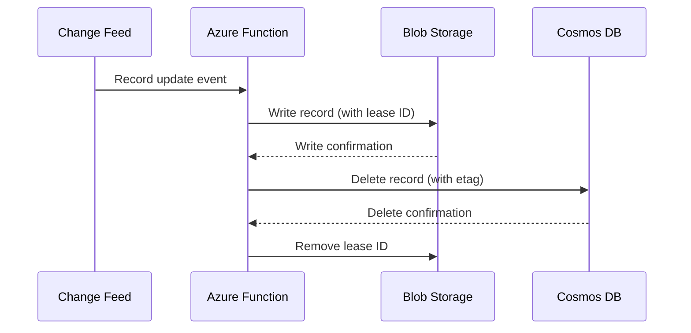
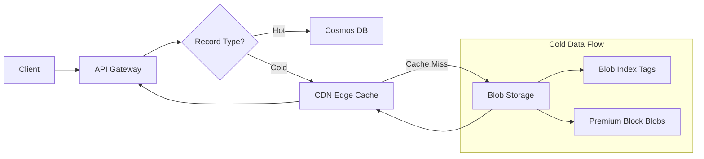
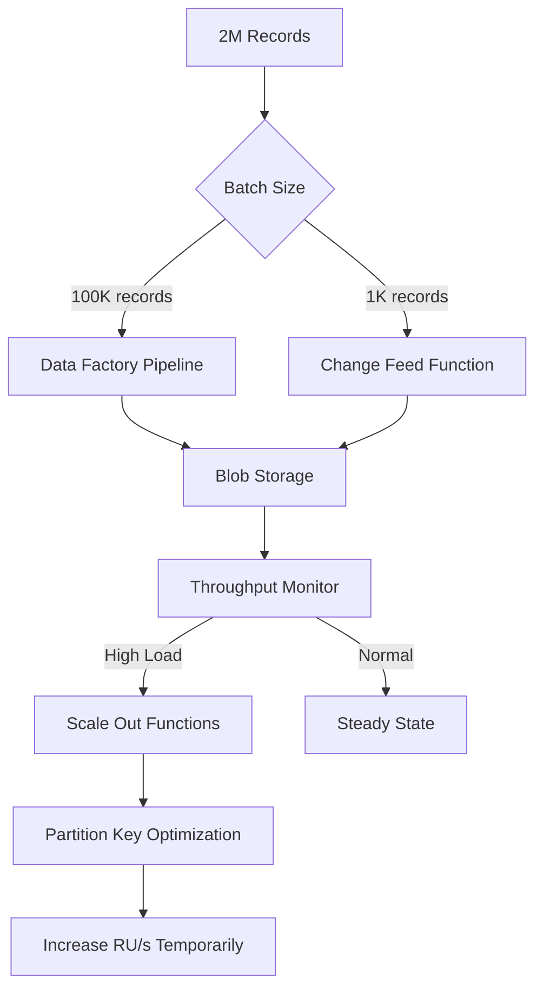
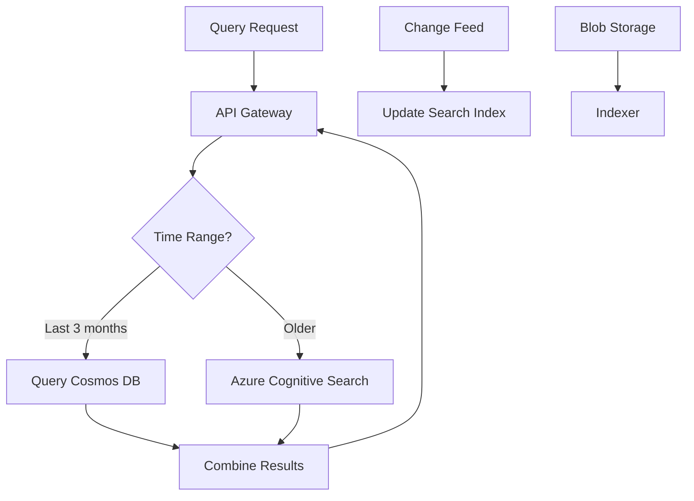
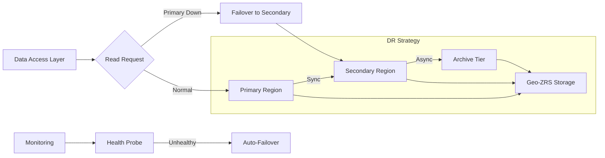
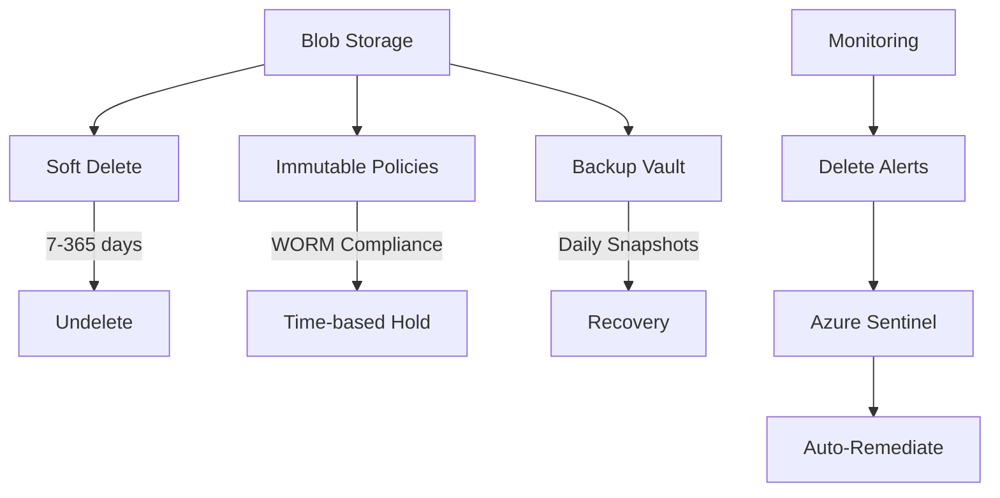

# Failure Scenarios Visuals

## Data Consistency Risks

## Latency Spikes for Cold Data

## Archival Backlog & Throughput

## Query Support Limitations

## Blob Storage Regional Outage

## Accidental Data Deletion

